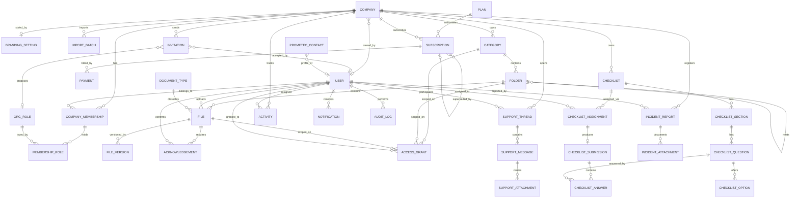

# Prometeo — Modello ER

Fonti: `docs/Prometeo.pdf` (Allegato 1 – Piano delle Attività), prototipo XD azienda
(317 schermate, "Arkistapp – Sviluppo") e prototipo XD lavoratore (110 schermate, "Flusso 1").

Integra inoltre le note "Struttura Ruoli e Gestione Abbonamenti" (4 ruoli, lavoratore
associato e non associato, subentro dell'abbonamento aziendale su quello personale) — vedi §3.

Il PDF descrive 3 ruoli (Operatore Prometeo / Cliente / Lavoratore) e un dominio documentale.
I prototipi aggiungono domini non presenti nel PDF: **organigramma D.Lgs 81/08**, **abbonamenti e
pagamenti**, **condivisione granulare (Visualizzatore / Custode / Editor)**, **checklist builder**,
**infortuni ± 40 gg / near miss**, **chat di assistenza**. Il modello copre l'unione dei due.

---

## 1. Diagramma

---

## 2. Entità

### 2.1 Tenancy e identità

**COMPANY** — radice del tenant. Due nature, distinte da `kind`:
`business` = azienda registrata; `personal` = workspace del lavoratore non associato.
`id, name, kind(business|personal), owner_user_id, vat_number, tax_code, legal_address,
ateco_code, employees_count, logo_path, status(active|suspended|archived),
created_by_operator_id, timestamps, deleted_at`

> Il workspace personale evita di rendere `company_id` nullable su `categories`, `folders`,
> `checklists`, `activities` e `incident_reports`: il lavoratore autonomo ha un tenant come
> tutti gli altri, e il suo "abbonamento personale" è la SUBSCRIPTION di quel workspace.
> `owner_user_id` = chi ha registrato il workspace (datore di lavoro o lavoratore autonomo).

**USER** — tabella unica per tutti (estende `users` già esistente).
`id, name, surname, email(unique), password, phone, fiscal_code, birth_date, avatar_path,
type(prometeo_operator|company_user), locale, must_change_password, last_login_at,
email_verified_at, timestamps, deleted_at`

> `type = prometeo_operator` → amministratore di sistema, nessuna membership.
> Tutti gli altri utenti esistono **solo** dentro una o più COMPANY.

**COMPANY_MEMBERSHIP** — appartenenza utente↔azienda.
`id, company_id, user_id, employee_code, department, hired_at,
status(invited|active|archived), is_admin, invited_by_id, timestamps`
Unique: `(company_id, user_id)`.
Il "Cambio profilo" del prototipo = utente con più membership.
`is_admin` è il permesso **applicativo** (invita, associa, gestisce i permessi dei
collaboratori), tenuto separato dai ruoli di sicurezza in ORG_ROLE: chi registra l'azienda
è amministratore anche se non è il datore di lavoro.

**INVITATION** — invito emesso anche prima che l'invitato abbia un account.
`id, company_id, email, token(unique), org_role_id, is_admin, invited_by_id,
expires_at, accepted_at, accepted_user_id, timestamps`
Indice unico parziale su `(company_id, email) WHERE accepted_at IS NULL`: un solo invito
pendente per indirizzo, gli inviti consumati restano come storico.

**ORG_ROLE** — ruoli dell'organigramma (seed statico, D.Lgs 81/08).
`id, code, label, is_unique_per_company, min_required`
Seed dai prototipi: `datore_lavoro`, `datore_lavoro_secondario`, `aspp`, `rspp`,
`medico_competente`, `rls`, `dirigente`, `preposto`, `lavoratore`.

**MEMBERSHIP_ROLE** — pivot: una membership può avere N ruoli (es. dirigente + preposto).
`id, company_membership_id, org_role_id, appointed_at, revoked_at, appointment_file_id`

**BRANDING_SETTING** — "Personalizzazione Interfaccia Grafica".
`id, company_id, primary_hex, secondary_hex, accent_hex, font_family(default Montserrat),
logo_path, icon_set`

**IMPORT_BATCH** — "Caricamento Massivo di Dati / Documenti" (CSV anagrafiche, upload bulk attestati).
`id, company_id, operator_id, kind(users_csv|documents_bulk), source_path,
rows_total, rows_ok, rows_failed, report_json, status, timestamps`

### 2.2 Abbonamenti

**PLAN** `id, code(free|premium), name, billing_period(monthly|yearly), price_cents,
max_users, features_json, is_active`

**SUBSCRIPTION** — sempre agganciata a un workspace, aziendale o personale.
`id, company_id, plan_id, status(trialing|active|past_due|canceled|superseded),
started_at, current_period_end, canceled_at, superseded_by_id, provider_ref`
`superseded` = piano individuale assorbito dall'abbonamento dell'azienda a cui il
lavoratore è stato associato; `superseded_by_id` punta all'abbonamento che lo copre.

**PAYMENT** `id, subscription_id, amount_cents, currency, status(pending|paid|failed),
paid_at, provider_ref, invoice_path`

### 2.3 Archivio documentale

**CATEGORY** — livello 1 della gerarchia, per azienda.
`id, company_id, name, icon, color, position, created_by_id, timestamps, deleted_at`

**FOLDER** — livello 2+, auto-referenziante (prototipo mostra cartelle in cartelle).
`id, category_id, parent_folder_id, name, icon, position, is_personal_of_user_id,
created_by_id, timestamps, deleted_at`
`is_personal_of_user_id` risolve la "cartella individuale" del lavoratore usata dal
caricamento massivo di attestati.

**DOCUMENT_TYPE** — regole di scadenza dinamica ("es. cinque anni per l'attestato antincendio").
`id, code, label, kind(attestato|certificato|dpi|visita_medica|generic),
validity_months, reminder_offsets_json, requires_acknowledgement_default`

**FILE**
`id, folder_id, document_type_id, name, media_kind(document|image|audio|video),
mime_type, size_bytes, current_version_id, issued_at, expires_at,
requires_acknowledgement, owner_user_id, uploaded_by_id, timestamps, deleted_at`
`expires_at` = `issued_at + document_type.validity_months`, ricalcolato in automatico
("le scadenze verranno ricalcolate in modo automatico").

**FILE_VERSION** — "versioni successive e storico delle modifiche" + "Azioni su file → Cronologia".
`id, file_id, version_no, storage_path, size_bytes, checksum, uploaded_by_id,
replaced_reason, created_at`

**ACCESS_GRANT** — condivisione granulare polimorfa ("Gestisci accesso" / "Condividi").
`id, grantable_type(category|folder|file), grantable_id,
grantee_type(user|org_role), grantee_id,
permission(viewer|custodian|editor), granted_by_id, expires_at, timestamps`
Semantica dai popup info del prototipo: **Visualizzatore** = sola lettura/download;
**Custode** = lettura + gestione scadenze/sostituzione versioni; **Editor** = pieno controllo.
`grantee_type = org_role` copre "condividi con tutti i preposti".

**ACKNOWLEDGEMENT** — "Presa Visione dei Documenti".
`id, file_id, file_version_id, user_id, required_at, viewed_at, confirmed_at,
signature_path, ip_address`
Unique: `(file_version_id, user_id)`.

### 2.4 Checklist

**CHECKLIST** `id, company_id, title, description, status(draft|published|archived),
frequency(one_shot|weekly|monthly|semiannual|annual), due_at, created_by_id,
published_at, timestamps, deleted_at`

**CHECKLIST_SECTION** `id, checklist_id, title, position`

**CHECKLIST_QUESTION** `id, checklist_section_id, label, help_text,
type(single_choice|multi_choice|text|date|time|image|number), is_required,
allows_attachment, position`
Il drag&drop tra sezioni del prototipo agisce su `(checklist_section_id, position)`.

**CHECKLIST_OPTION** `id, checklist_question_id, label, image_path, position, is_non_conformity`

**CHECKLIST_ASSIGNMENT** `id, checklist_id, assignee_type(user|org_role), assignee_id,
due_at, status(pending|in_progress|completed|expired), assigned_by_id, timestamps`

**CHECKLIST_SUBMISSION** `id, checklist_assignment_id, submitted_by_id, started_at,
submitted_at, status(draft|submitted), export_pdf_path`

**CHECKLIST_ANSWER** `id, checklist_submission_id, checklist_question_id,
value_text, value_date, value_time, value_number, selected_option_ids_json, attachment_path`

### 2.5 Attività, notifiche, audit

**ACTIVITY** — alimenta "Monitora attività" (con filtri per tipo/stato/ruolo/data).
`id, company_id, subject_type(file|checklist_assignment|incident_report),
subject_id, assignee_user_id, kind(read_document|fill_checklist|renew_certificate),
status(todo|done|overdue), due_at, completed_at, timestamps`

> Vista derivabile da ACKNOWLEDGEMENT + CHECKLIST_ASSIGNMENT + FILE.expires_at.
> Tabella materializzata perché entrambi i prototipi la filtrano e paginano.

**NOTIFICATION** `id(uuid), type, notifiable_type, notifiable_id, data,
read_at, company_id, channel(push|email|in_app), subject_type, subject_id, sent_at, timestamps`
Schema allineato a `Illuminate\Notifications\DatabaseNotification`: si riusa il canale
`database` di Laravel invece di scrivere un layer di notifiche custom.
Trigger dal PDF: upload/modifica documento, scadenza imminente, richiesta presa visione,
nuovo messaggio in assistenza, checklist assegnata.

**AUDIT_LOG** — "Ogni operazione di caricamento, modifica e accesso ai documenti è tracciata".
`id, company_id, user_id, action, auditable_type, auditable_id, changes_json,
ip_address, user_agent, created_at`

### 2.6 Infortuni e segnalazioni

**INCIDENT_REPORT**
`id, company_id, kind(near_miss|injury), severity_bucket(under_40_days|over_40_days),
is_anonymous, reported_by_id(nullable), occurred_at, reported_at, location,
department, description, causes, actions_taken, injured_person_name,
absence_days, inail_ref, status(draft|submitted|under_review|closed),
reviewed_by_id, closed_at, timestamps`
`is_anonymous = true` → `reported_by_id` NULL (segnalazione anonima da specifiche PDF);
`severity_bucket` deriva da `absence_days` (soglia 40 gg dei prototipi).

**INCIDENT_ATTACHMENT** `id, incident_report_id, storage_path, media_kind, caption, created_at`

### 2.7 Assistenza e contatti

**SUPPORT_THREAD** `id, company_id, opened_by_id, assigned_operator_id, subject,
channel(chat|email|call), status(open|pending|closed), last_message_at, closed_at, timestamps`

**SUPPORT_MESSAGE** `id, support_thread_id, sender_id, body,
kind(text|image|video|audio|file|call_log), call_duration_seconds, read_at, created_at`

**SUPPORT_ATTACHMENT** `id, support_message_id, storage_path, media_kind, size_bytes`

**PROMETEO_CONTACT** — "Integrazione Contatti Prometeo" (rubrica staff visibile a tutti i tenant).
`id, user_id(nullable), display_name, role_label, email, phone, avatar_path, position, is_visible`

---

## 3. I quattro ruoli e la copertura dell'abbonamento

| Ruolo delle note | Come è modellato |
|---|---|
| **Super Admin** | `users.type = prometeo_operator`. Nessuna membership, bypassa il global scope, opera su tutti i tenant. È l'"Operatore Prometeo" del PDF: stesso ruolo, non se ne aggiunge un secondo. |
| **Azienda** | COMPANY `kind = business` + almeno una COMPANY_MEMBERSHIP con `is_admin = true`. Autoregistrazione = `created_by_operator_id` NULL, `owner_user_id` = chi si è registrato. |
| **Lavoratore associato** | COMPANY_MEMBERSHIP `status = active` su un workspace `business`. Nessun abbonamento proprio: la copertura arriva dal workspace. |
| **Lavoratore non associato** | COMPANY `kind = personal` con `owner_user_id` = lui, più la sua membership `is_admin`. L'abbonamento personale è la SUBSCRIPTION di quel workspace. |

Un utente non è mai "di un solo tipo": può avere contemporaneamente il workspace personale
e una o più membership aziendali. Il ruolo è una proprietà della **relazione**, non della persona.

**Regola di copertura** — `User::hasEntitlingSubscription()`: esiste almeno un workspace attivo
dell'utente (personale o aziendale) con una SUBSCRIPTION in stato `trialing|active|past_due`.
Una sola query, nessuna gerarchia di casi da tenere allineata.

**Subentro automatico** — `CompanyMembershipObserver::saved()`: quando una membership diventa
`active` su un workspace `business` che ha un abbonamento attivo, ogni abbonamento del workspace
personale di quell'utente passa a `superseded` con `canceled_at` e `superseded_by_id` valorizzati.
Scatta da qualunque percorso: accettazione invito, associazione manuale, import massivo.

Non implementato di proposito: la **riattivazione** del piano individuale quando il lavoratore
esce dall'azienda. Le note non la richiedono e coinvolge un pagamento — va decisa col cliente
(riattivazione automatica, oppure invito a risottoscrivere). Lo storico per farlo c'è già:
`superseded_by_id` dice quale abbonamento aveva assorbito quale.

## 4. Vincoli e regole trasversali

| Regola | Dove | Note |
|---|---|---|
| Isolamento tenant | `company_id` su ogni radice | Global scope Eloquent su membership dell'utente autenticato |
| Operatore Prometeo bypassa lo scope | `users.type` | Unico ruolo con scrittura su tutti i tenant |
| Lavoratore = sola lettura + presa visione + near miss + checklist | ACCESS_GRANT / policy | Il PDF nega modifica contenuti al lavoratore; il prototipo lavoratore mostra però "Crea nuova cartella"/"Aggiungi file" → serve conferma prodotto (§4) |
| Un solo `datore_lavoro` attivo per azienda | `ORG_ROLE.is_unique_per_company` | Il prototipo prevede un "secondo DDL" → flag separato `datore_lavoro_secondario` |
| Scadenze ricalcolate | job schedulato su FILE + DOCUMENT_TYPE | Genera NOTIFICATION e ACTIVITY `renew_certificate` |
| Soft delete su CATEGORY/FOLDER/FILE | `deleted_at` | Prototipo mostra "Elimina" con conferma, non distruzione immediata |
| Cancellazione account | `USER.deleted_at` + membership `archived` | "Popup elimina account" / "Organigramma – profili archiviati" |

---

## 5. Stato implementazione

| Artefatto | Percorso |
|---|---|
| Migrazioni (8: 7 per dominio + delta ruoli/abbonamenti) | `database/migrations/2026_08_03_1000*` |
| Enum di dominio (16) | `app/Enums/` |
| Model Eloquent (32) + relazioni | `app/Models/` |
| Subentro abbonamento | `app/Observers/CompanyMembershipObserver.php` |
| Morph map (alias polimorfi stabili) | `app/Providers/AppServiceProvider.php` |
| Seed statici (ruoli, tipi documento, piani) | `database/seeders/` |
| Test sul grafo documentale | `tests/Feature/ErModelTest.php` |
| Test su ruoli, workspace, abbonamenti, inviti | `tests/Feature/SubscriptionScopeTest.php` |

Logica non banale già nei model:

- `File::recalculateExpiry()` — hook `saving`: `expires_at = issued_at + document_type.validity_months`,
  non sovrascrive una scadenza impostata a mano.
- `IncidentReport::booted()` — azzera `reported_by_id` se `is_anonymous`, deriva `severity_bucket`
  da `absence_days` (soglia 40 gg).
- `AccessGrant::scopeForUser()` — unisce i grant diretti dell'utente a quelli dei ruoli
  organigramma non revocati.
- `Company::personalFor()` — crea (idempotente) workspace personale + membership `is_admin`.
- `CompanyMembershipObserver::saved()` — subentro dell'abbonamento aziendale su quello personale.
- `Invitation::booted()` — genera token e scadenza a 14 giorni.

Non ancora fatto: controller/API, policy di autorizzazione, form request, job di ricalcolo
scadenze e invio notifiche, factory oltre `UserFactory`.

## 6. Punti da confermare con il cliente

1. **Permessi del lavoratore**: il PDF lo dà in sola lettura, il prototipo lavoratore
   include creazione cartelle e upload file. Se confermato l'upload, ACCESS_GRANT con
   `permission = editor` sulla propria cartella personale copre il caso senza modifiche allo schema.
2. **Riattivazione del piano individuale** quando il lavoratore lascia l'azienda: non prevista
   dalle note, non implementata. Vedi §3.
3. **Firma della presa visione**: `signature_path` previsto ma i prototipi mostrano solo
   conferma tap. Tenere nullable.
4. **Multi-azienda per utente**: "Cambio profilo" implica che un consulente (RSPP esterno)
   segua più aziende. Modellato, da confermare.
5. **Chiamata in-app**: `SUPPORT_MESSAGE.kind = call_log` registra solo il metadato; nessuna
   entità per la telefonia (il prototipo lancia il dialer di sistema).
