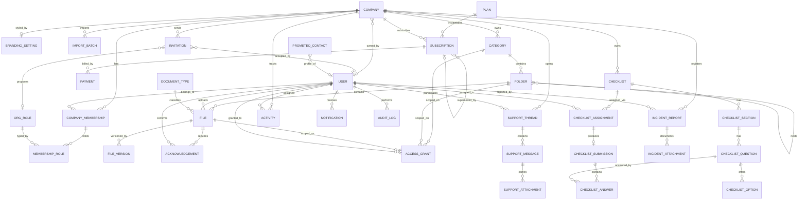

# Prometeo — ER model

Sources: `docs/Prometeo.pdf` (Allegato 1 – Piano delle Attività), the company XD prototype
(317 screens, "Arkistapp – Sviluppo") and the worker XD prototype (110 screens, "Flusso 1").

It also folds in the "Struttura Ruoli e Gestione Abbonamenti" notes (4 roles, associated and
unassociated worker, a company subscription superseding a personal one) — see §3.

The specification describes 3 roles (Prometeo operator / client company / worker) and a document
domain. The prototypes add domains the specification never mentions: the **D.Lgs 81/08 org chart**,
**subscriptions and payments**, **granular sharing (Visualizzatore / Custode / Editor)**, a
**checklist builder**, **injuries ±40 days / near misses**, and a **support chat**. This model
covers the union of both.

---

## 1. Diagram

---

## 2. Entities

### 2.1 Tenancy and identity

**COMPANY** — the tenant root. Two natures, told apart by `kind`:
`business` = a registered company; `personal` = the workspace of an unassociated worker.
`id, name, kind(business|personal), owner_user_id, vat_number, tax_code, legal_address,
ateco_code, employees_count, logo_path, status(active|suspended|archived),
created_by_operator_id, timestamps, deleted_at`

> The personal workspace avoids making `company_id` nullable on `categories`, `folders`,
> `checklists`, `activities` and `incident_reports`: a self-employed worker gets a tenant like
> everybody else, and their "personal subscription" is the SUBSCRIPTION of that workspace.
> `owner_user_id` = whoever registered the workspace (employer or self-employed worker).

**USER** — one table for everyone (extends the existing `users`).
`id, name, surname, email(unique), password, phone, fiscal_code, birth_date, avatar_path,
type(prometeo_operator|company_user), locale, must_change_password, last_login_at,
email_verified_at, timestamps, deleted_at`

> `type = prometeo_operator` → system administrator, no membership.
> Every other user exists **only** inside one or more COMPANY.

**COMPANY_MEMBERSHIP** — the user↔company relationship.
`id, company_id, user_id, employee_code, department, hired_at,
status(invited|active|archived), is_admin, invited_by_id, timestamps`
Unique: `(company_id, user_id)`.
The prototype's "Cambio profilo" = a user with more than one membership.
`is_admin` is the **application** permission (invite, associate, manage collaborators'
permissions), kept apart from the safety roles in ORG_ROLE: whoever registers the company is
an administrator even when they are not the employer.

**INVITATION** — issued even before the invitee has an account.
`id, company_id, email, token(unique), org_role_id, is_admin, invited_by_id,
expires_at, accepted_at, accepted_user_id, timestamps`
Partial unique index on `(company_id, email) WHERE accepted_at IS NULL`: one pending invitation
per address, while consumed invitations remain as history.

**ORG_ROLE** — org chart roles (static seed, D.Lgs 81/08).
`id, code, label, is_unique_per_company, min_required`
Seeded from the prototypes: `datore_lavoro`, `datore_lavoro_secondario`, `aspp`, `rspp`,
`medico_competente`, `rls`, `dirigente`, `preposto`, `lavoratore`.

**MEMBERSHIP_ROLE** — pivot: one membership can hold N roles (e.g. dirigente + preposto).
`id, company_membership_id, org_role_id, appointed_at, revoked_at, appointment_file_id`

**BRANDING_SETTING** — "Personalizzazione Interfaccia Grafica".
`id, company_id, primary_hex, secondary_hex, accent_hex, font_family(default Montserrat),
logo_path, icon_set`

**IMPORT_BATCH** — "Caricamento Massivo di Dati / Documenti" (personnel CSV, bulk certificate upload).
`id, company_id, operator_id, kind(users_csv|documents_bulk), source_path,
rows_total, rows_ok, rows_failed, report_json, status, timestamps`

### 2.2 Subscriptions

**PLAN** `id, code(free|premium), name, billing_period(monthly|yearly), price_cents,
max_users, features_json, is_active`

**SUBSCRIPTION** — always attached to a workspace, whether company or personal.
`id, company_id, plan_id, status(trialing|active|past_due|canceled|superseded),
started_at, current_period_end, canceled_at, superseded_by_id, provider_ref`
`superseded` = an individual plan absorbed by the subscription of the company the worker
joined; `superseded_by_id` points at the subscription that now covers them.

**PAYMENT** `id, subscription_id, amount_cents, currency, status(pending|paid|failed),
paid_at, provider_ref, invoice_path`

### 2.3 Document archive

**CATEGORY** — level 1 of the hierarchy, per company.
`id, company_id, name, icon, color, position, created_by_id, timestamps, deleted_at`

**FOLDER** — level 2 and deeper, self-referencing (the prototype nests folders in folders).
`id, category_id, parent_folder_id, name, icon, position, is_personal_of_user_id,
created_by_id, timestamps, deleted_at`
`is_personal_of_user_id` covers the worker's "individual folder" targeted by the bulk
certificate upload.

**DOCUMENT_TYPE** — dynamic expiry rules ("e.g. five years for the fire safety certificate").
`id, code, label, kind(attestato|certificato|dpi|visita_medica|generic),
validity_months, reminder_offsets_json, requires_acknowledgement_default`

**FILE**
`id, folder_id, document_type_id, name, media_kind(document|image|audio|video),
mime_type, size_bytes, current_version_id, issued_at, expires_at,
requires_acknowledgement, owner_user_id, uploaded_by_id, timestamps, deleted_at`
`expires_at` = `issued_at + document_type.validity_months`, recalculated automatically
("le scadenze verranno ricalcolate in modo automatico").

**FILE_VERSION** — "versioni successive e storico delle modifiche" + "Azioni su file → Cronologia".
`id, file_id, version_no, storage_path, size_bytes, checksum, uploaded_by_id,
replaced_reason, created_at`

**ACCESS_GRANT** — polymorphic granular sharing ("Gestisci accesso" / "Condividi").
`id, grantable_type(category|folder|file), grantable_id,
grantee_type(user|org_role), grantee_id,
permission(viewer|custodian|editor), granted_by_id, expires_at, timestamps`
Semantics from the prototype's info popups: **Visualizzatore** = read and download only;
**Custode** = read plus expiry management and version replacement; **Editor** = full control.
`grantee_type = org_role` covers "share with every preposto".

> Grants cascade downwards — a grant on a category reaches its folders and their files —
> and the strongest one wins when several apply (`App\Support\EffectiveAccess`).
> Two things they do **not** do: they never *reduce* what a member can read, since every
> active member of a company reads its non-personal archive by default, and they never
> apply to a personal folder's owner, who always manages their own branch. Grants only
> ever add access, which is why they are also how an external consultant reaches a single
> file without being a member.

**ACKNOWLEDGEMENT** — "Presa Visione dei Documenti".
`id, file_id, file_version_id, user_id, required_at, viewed_at, confirmed_at,
signature_path, ip_address`
Unique: `(file_version_id, user_id)`.

### 2.4 Checklists

**CHECKLIST** `id, company_id, title, description, status(draft|published|archived),
frequency(one_shot|weekly|monthly|semiannual|annual), due_at, created_by_id,
published_at, timestamps, deleted_at`

**CHECKLIST_SECTION** `id, checklist_id, title, position`

**CHECKLIST_QUESTION** `id, checklist_section_id, label, help_text,
type(single_choice|multi_choice|text|date|time|image|number), is_required,
allows_attachment, position`
The prototype's cross-section drag & drop acts on `(checklist_section_id, position)`.

**CHECKLIST_OPTION** `id, checklist_question_id, label, image_path, position, is_non_conformity`

**CHECKLIST_ASSIGNMENT** `id, checklist_id, assignee_type(user|org_role), assignee_id,
due_at, status(pending|in_progress|completed|expired), assigned_by_id, timestamps`

**CHECKLIST_SUBMISSION** `id, checklist_assignment_id, submitted_by_id, started_at,
submitted_at, status(in_progress|completed), export_pdf_path`
Unique on `checklist_assignment_id`: the relation is a HasOne, so one submission per
assignment is enforced by the database rather than by the caller.

**CHECKLIST_ANSWER** `id, checklist_submission_id, checklist_question_id,
value_text, value_date, value_time, value_number, selected_option_ids_json, attachment_path`

### 2.5 Activities, notifications, audit

**ACTIVITY** — backs "Monitora attività" (filters by kind/status/role/date).
`id, company_id, subject_type(file|checklist_assignment|incident_report),
subject_id, assignee_user_id, kind(read_document|fill_checklist|renew_certificate),
status(todo|done|overdue), due_at, completed_at, timestamps`

> Derivable from ACKNOWLEDGEMENT + CHECKLIST_ASSIGNMENT + FILE.expires_at.
> Materialized as a table because both prototypes filter and paginate it.

**NOTIFICATION** `id(uuid), type, notifiable_type, notifiable_id, data,
read_at, company_id, channel(push|email|in_app), subject_type, subject_id, sent_at, timestamps`
Schema aligned with `Illuminate\Notifications\DatabaseNotification`: Laravel's `database`
channel is reused instead of writing a custom notification layer.
Triggers from the specification: document uploaded or changed, upcoming expiry, acknowledgement
requested, new support message, checklist assigned.

**AUDIT_LOG** — "Ogni operazione di caricamento, modifica e accesso ai documenti è tracciata".
`id, company_id, user_id, action, auditable_type, auditable_id, changes_json,
ip_address, user_agent, created_at`

### 2.6 Incidents and reports

**INCIDENT_REPORT**
`id, company_id, kind(near_miss|injury), severity_bucket(under_40_days|over_40_days),
is_anonymous, reported_by_id(nullable), occurred_at, reported_at, location,
department, description, causes, actions_taken, injured_person_name,
absence_days, inail_ref, status(draft|submitted|under_review|closed),
reviewed_by_id, closed_at, timestamps`
`is_anonymous = true` → `reported_by_id` NULL (anonymous reporting is required by the
specification); `severity_bucket` derives from `absence_days` (the prototypes' 40-day threshold).

**INCIDENT_ATTACHMENT** `id, incident_report_id, storage_path, media_kind, caption, created_at`

### 2.7 Support and contacts

**SUPPORT_THREAD** `id, company_id, opened_by_id, assigned_operator_id, subject,
channel(chat|email|call), status(open|pending|closed), last_message_at, closed_at, timestamps`

**SUPPORT_MESSAGE** `id, support_thread_id, sender_id, body,
kind(text|image|video|audio|file|call_log), call_duration_seconds, read_at, created_at`

**SUPPORT_ATTACHMENT** `id, support_message_id, storage_path, media_kind, size_bytes`

**PROMETEO_CONTACT** — "Integrazione Contatti Prometeo" (staff directory visible to every tenant).
`id, user_id(nullable), display_name, role_label, email, phone, avatar_path, position, is_visible`

---

## 3. The four roles and subscription coverage

| Role in the notes | How it is modelled |
|---|---|
| **Super Admin** | `users.type = prometeo_operator`. No membership, bypasses the global scope, operates across every tenant. This is the specification's "Operatore Prometeo": the same role, not a second one. |
| **Company** | COMPANY `kind = business` plus at least one COMPANY_MEMBERSHIP with `is_admin = true`. Self-registration = `created_by_operator_id` NULL, `owner_user_id` = whoever signed up. |
| **Associated worker** | COMPANY_MEMBERSHIP `status = active` on a `business` workspace. No subscription of their own: coverage comes from the workspace. |
| **Unassociated worker** | COMPANY `kind = personal` with `owner_user_id` = them, plus their own `is_admin` membership. The personal subscription is the SUBSCRIPTION of that workspace. |

A user is never "of one type only": they can hold a personal workspace and one or more company
memberships at the same time. The role is a property of the **relationship**, not of the person.

**Coverage rule** — `User::hasEntitlingSubscription()`: at least one active workspace of the user
(personal or company) has a SUBSCRIPTION in state `trialing|active|past_due`. A single query, with
no hierarchy of cases to keep in sync.

**Automatic supersession** — `CompanyMembershipObserver::saved()`: when a membership turns
`active` on a `business` workspace that holds an active subscription, every subscription of that
user's personal workspace moves to `superseded`, with `canceled_at` and `superseded_by_id` set.
It fires from every path: invitation accepted, manual association, bulk import.

Deliberately not implemented: **reactivating** the individual plan when the worker leaves the
company. The notes do not ask for it and it involves a payment — the client has to decide
(automatic reactivation, or an invitation to re-subscribe). The history needed to do it is
already there: `superseded_by_id` records which subscription absorbed which.

## 4. Cross-cutting constraints and rules

| Rule | Where | Notes |
|---|---|---|
| Tenant isolation | `company_id` on every root | Eloquent global scope driven by the authenticated user's memberships |
| Prometeo operator bypasses the scope | `users.type` | The only role that writes across every tenant |
| Worker writes only inside their own personal branch | `FilePolicy`, `FolderPolicy` | Confirmed with the client: the worker prototype's upload screens win over the specification's read-only wording. They upload, rename, delete and create sub-folders under their own personal folder — but not rename the personal folder itself, which belongs to the company's structure |
| Sharing levels are enforced, not just stored | `EffectiveAccess` + policies | `custodian` updates metadata and replaces versions, `editor` also deletes, `viewer` writes nothing. Before this, `permission` was validated on the way in and then ignored |
| One active `datore_lavoro` per company | `ORG_ROLE.is_unique_per_company` | The prototype allows a "second employer" → separate `datore_lavoro_secondario` role |
| Expiry dates recalculated | scheduled job over FILE + DOCUMENT_TYPE | Produces NOTIFICATION and ACTIVITY `renew_certificate` |
| Soft delete on CATEGORY/FOLDER/FILE | `deleted_at` | The prototype shows "Elimina" behind a confirmation, not immediate destruction |
| Account deletion | `USER.deleted_at` + membership `archived` | "Popup elimina account" / "Organigramma – profili archiviati" |

---

## 5. Implementation status

| Artefact | Path |
|---|---|
| Migrations (8: 7 per domain + roles/subscriptions delta) | `database/migrations/2026_08_03_1000*` |
| Domain enums (16) | `app/Enums/` |
| Eloquent models (32) with relationships | `app/Models/` |
| Subscription supersession | `app/Observers/CompanyMembershipObserver.php` |
| Morph map (stable polymorphic aliases) | `app/Providers/AppServiceProvider.php` |
| Static seeds (roles, document types, plans) | `database/seeders/` |
| Tests over the document graph | `tests/Feature/ErModelTest.php` |
| Tests over roles, workspaces, subscriptions, invitations | `tests/Feature/SubscriptionScopeTest.php` |

Non-trivial logic already living in the models:

- `File::recalculateExpiry()` — `saving` hook: `expires_at = issued_at + document_type.validity_months`,
  never overwriting an expiry date set by hand.
- `IncidentReport::booted()` — clears `reported_by_id` when `is_anonymous`, derives `severity_bucket`
  from `absence_days` (40-day threshold).
- `AccessGrant::scopeForUser()` — merges the user's direct grants with those of their non-revoked
  org chart roles.
- `Company::personalFor()` — idempotently creates the personal workspace plus its `is_admin` membership.
- `CompanyMembershipObserver::saved()` — company subscription superseding the personal one.
- `Invitation::booted()` — generates the token and a 14-day expiry.

The API, its policies, form requests and factories now exist across all seven slices
(`routes/slices/`, `app/Http/`, `app/Policies/`, `database/factories/`).

Two rules that are easy to break by accident, both now enforced in one place:

- `User::activeOrgRoleIds()` / `activeCompanyIds()` — every permission derived from an org
  role must end when the membership is archived. Both the access-grant scope and the
  checklist assignment lookup read from here; a third caller must do the same rather than
  write its own query.
- `App\Support\EffectiveAccess` — resolves the strongest grant covering a file or folder,
  walking up the folder chain to the category. All write policies go through it.

Still not done: the scheduled jobs that recalculate expiry dates and send notifications,
and self-registration (a worker's personal workspace is created by
`POST /companies/personal`, which the client calls after the first login).

## 6. Open questions for the client

1. **Reactivating the individual plan** when a worker leaves the company: not covered by the
   notes, not implemented. See §3.
2. **Acknowledgement signature**: `signature_path` exists, but the prototypes only show a tap
   confirmation. Keep it nullable.
3. **One user across several companies**: "Cambio profilo" implies an external consultant (say an
   outsourced RSPP) following more than one company. Modelled; confirm it as a requirement.
4. **In-app call**: `SUPPORT_MESSAGE.kind = call_log` records the metadata only — no entity for
   telephony, since the prototype launches the system dialer.

Settled during development, kept here because the sources disagree: the specification states both
that clients get "accesso in lettura e scrittura ai propri documenti" and that a client "non avrà
alcuna possibilità di modifica dei contenuti". The prototypes are more recent and show full write
access; the client confirmed the prototypes win.
